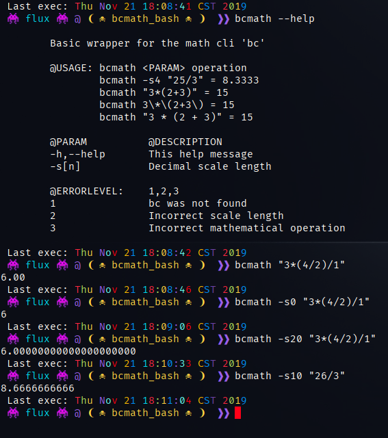

# bcmath_bash

bcmath is a function/script wrapper for the shell cli math utility 'bc'.

## Motivation

I wanted a cleaner way to do floating math in Bash.

Rather than:

```Bash
echo "scale=2;25/3" | bc # 8.33
```

I'd rather do:

```Bash
bcmath "25/3" # 8.33
```

or:

```Bash
bcmath -s4 "25/3" # 8.3333
```

## Screenshot



## Installation

The function is provided in both the script [.sh] file and the function file [.bash].

The script file should be placed where your other scripts are; preferably somewhere in $PATH.

The function can be placed in any of your profile bash config files that you source E.G: .bash_profile or .bash_funcs.

You can uncomment and use the '# complete...' line to add Bash completion capability. Uncomment for the script file and add to your function file with the function.

Both the script and the function return or exit ERRORLEVEL.

## Usage

```Bash
bcmath --help

```

Basic wrapper for the math cli 'bc'

- @USAGE: bcmath \<PARAM\> operation
  - bcmath -s4 "25/3" = 8.3333
  - bcmath "3*(2+3)" = 15
  - bcmath 3\*\(2+3\) = 15
  - bcmath "3 * (2 + 3)" = 15
- @PARAM @DESCRIPTION
  - -h,--help This help message
  - -s[n] Decimal scale length
- @ERRORLEVEL: 1,2,3
  - 1 bc was not found
  - 2 Incorrect scale length
  - 3 Incorrect mathematical operation
